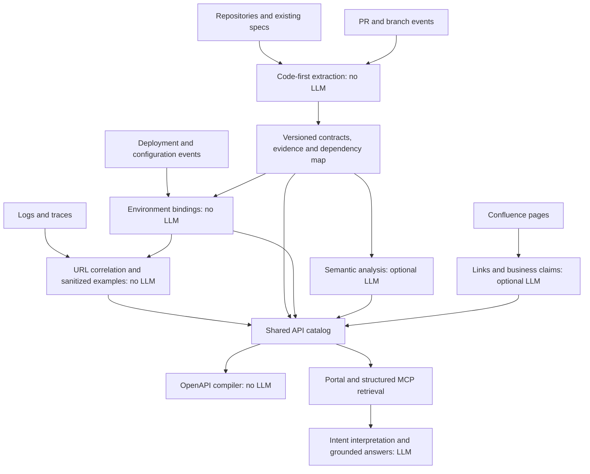

# API Truth — Product Specification

**Version:** 0.1 draft  
**Date:** 2026-09-15  
**Implementation status:** not started  
**Related documents:** [architecture](ARCHITECTURE.md), [project plan](../PROJECT%20PLAN.md), [roadmap](ROADMAP.md)

This document defines the intended product. “Must” denotes a release requirement for the phase assigned in the roadmap. “Should” denotes a preference that may change with evidence. Requirements are not claims about implemented functionality.

## 1. Purpose and users

Build and continuously maintain an enterprise API knowledge base where no reliable catalog or documentation exists. Given a business intent and environment, a developer, architect, or their AI assistant can discover suitable APIs, understand limitations, retrieve precise calling contracts, and inspect the evidence behind an answer.

| User | Primary need |
|---|---|
| Developer | Find an API and obtain enough accurate context to implement an integration |
| Architect | Discover capabilities, ownership, evidenced relationships, constraints, and environment differences |
| Service owner | Review generated documentation, correct business meaning, and resolve discrepancies |
| Platform engineer | Onboard repositories, connect pipelines, manage access, and monitor update failures |
| AI assistant via MCP | Retrieve scoped, versioned contracts and explanations without inventing APIs or parameters |

### Success example

For “How can I issue a partial refund in production?”, the system returns a supported API with the production contract and URL, prerequisites, permissions, mandatory and conditional inputs, example payloads, and sources. If the API is only available in UAT, the answer states that distinction. If coverage is incomplete, the answer describes the search scope rather than claiming enterprise-wide absence.

## 2. Product boundaries

### In scope for the planned v1

- HTTP API discovery from supported TypeScript/JavaScript and Java frameworks.
- Initial repository baselines and automatic updates through CI/CD.
- Environment branches, deployment revisions, exposure mappings, and rollbacks.
- Request/response schemas, validation rules, security declarations, and extraction gaps.
- Code-first inventory enriched with logs, traces, and routing configuration.
- OpenAPI 3.1 export, developer portal, and read-only MCP discovery/retrieval.
- Evidence-backed semantic descriptions and proposed business rules.
- Selected Confluence integration, owner review, and discrepancy analysis.
- Self-hosting, source-aware authorization, auditability, and configurable inference providers.

### Out of initial scope

- Executing business APIs, deploying services, or autonomously generating and merging application changes.
- General-purpose enterprise search, observability dashboards, or API gateway management.
- Proving complete behavior of arbitrary programs or complete enterprise API coverage.
- GraphQL, gRPC, event-contract discovery, and autonomous multi-service orchestration.
- Automatic deletion recommendations based on lack of traffic.
- Automatic edits to Confluence or source repositories.
- A hosted multi-tenant SaaS offering. Initial deployment is one enterprise installation with internal access boundaries.

## 3. Required system flow

Deterministic extraction, contract comparison, URL correlation, OpenAPI compilation, and exact retrieval must work without a generative model. A portal assistant may use a configured model; an external MCP client supplies its own reasoning model. Semantic search may use embeddings, which are an optional additional model dependency.

## 4. Functional requirements

### FR-01 — Repository and service onboarding

- Configure repository identities, service roots in monorepos, framework adapters, owners, branch/environment mappings, and access policies.
- Perform an initial baseline scan. Subsequent updates must not depend on developers initiating manual scans.
- Import existing API specs as a named evidence source when present; do not make their existence a prerequisite.
- Record supported and unsupported constructs, scan status, repository revision, and scope. Inferred ownership must be distinguishable from confirmed ownership.
- Repositories and branches can be onboarded independently. Service identity must not depend on its current display name or host URL.

### FR-02 — Code-first discovery

- Follow supported route registrations, controller mappings, mounted prefixes, and routing predicates to discover application endpoints.
- Extract method, application route, handler references, request and response media types, schemas, response statuses, and applicable security declarations.
- Follow relevant shared types, validators, serializers, middleware, exception handling, and service calls within the adapter's documented support boundary.
- Report unresolved dynamic routes and incomplete analysis. An unsupported construct must not silently disappear from the coverage report.
- Type declarations, runtime validators, and inferred behavior must have distinct evidence methods.
- Scanning must not execute application startup, build scripts, or repository hooks by default. Any runtime extraction mode is a separate operator-configured capability.

### FR-03 — Schemas and conditional requirements

- Represent nested objects, arrays, maps, references, unions, enums, defaults, formats, nullability, and constraints without conflating request and response serialization.
- Distinguish required, optional, conditional, and unknown field presence. Missing validation evidence is not proof of optionality.
- Record conditions as structured predicates where supported, with field paths, scope, source locations, and verification status.
- Keep external-state conditions, such as account eligibility, as evidenced business rules when they cannot be represented by the request schema.
- Separate declared-required, observed-present, observed-accepted-without, and inferred-conditional claims.
- LLM-generated predicates must reference known schema paths and carry evidence. Syntactic validity does not establish behavioral correctness.

### FR-04 — Continuous updates from the first working release

- Accept baseline, PR, branch-update, deployment, configuration-change, and reconciliation events through provider-neutral interfaces.
- Compare PRs with their declared base revision and publish isolated previews. PR results must not change the active environment catalog.
- After merge or branch update, publish a branch documentation snapshot tied to the exact analyzed revision.
- Identify affected APIs through dependency tracking, including shared validators and DTOs. When dependency coverage is insufficient, automatically rescan the affected service or wider configured scope.
- Detect endpoint additions/removals and request, response, security, and condition changes. Label compatibility findings as potential breaking changes where consumer impact is unknown.
- CI starts in report-only mode. Organizations may configure blocking rules for selected confirmed changes or failed analysis.
- Cache by all relevant dependencies and tool versions. Failed or superseded jobs must not overwrite a newer valid view or falsely claim that documentation is current.
- Support replay, retries, idempotency, missed-event reconciliation, and visible publication failures. Reconciliation may rescan automatically; “no manual rescan” is the promise, not “never analyze again.”

### FR-05 — Environment-aware documentation from the first working release

- Model branch intent separately from deployment state. A branch-to-environment mapping never proves successful deployment.
- Bind deployment records to service, environment, immutable artifact/revision identity, configuration fingerprint, and a source event.
- Support configurable environment names, different branches per service, and promotion of the same artifact across environments.
- Track these facts independently: presence in code, deployment status, route exposure, observation window, and last successful documentation update.
- Use explicit states, including unknown and confirmed-not-deployed. Only authoritative inventory or lifecycle evidence may establish absence; no log traffic is insufficient.
- Preserve candidate/ambiguous/confirmed URL mappings. Availability may depend on routing configuration and feature flags even for identical code revisions.
- Update environment documentation from authoritative serving-state evidence after deployment and rollback. A failed attempt does not establish that the prior revision is still serving or that rollback completed; reconcile the active revision set and retain mixed or unknown state until evidence resolves it. Keep the last valid documentation snapshot available as historical or stale when current serving state cannot be established.
- During rolling deployments, retain multiple active revisions or mark the state transitional; do not silently select a single contract when evidence indicates mixed traffic.
- If a deployed revision has not been analyzed, expose its documentation as pending or incomplete rather than substituting the branch tip.
- Queries and exports must select an environment or an explicit branch/revision view. When an omitted environment materially changes the recommendation, ask for clarification unless a disclosed user default resolves it.

### FR-06 — Log enrichment

- Start from code-discovered endpoints and correlate traffic using service/environment identity, method, route metadata, trace linkage, and routing configuration.
- Keep public URL templates distinct from application paths. One API can have several deployment addresses; do not duplicate path prefixes when producing `servers` and `paths`.
- Prefer explicit route and trace evidence. Heuristic path matching must preserve ambiguity rather than rely on a universal longest-prefix rule.
- Capture observed status distributions, field-presence counts, sampling/completeness metadata, and paired request/response examples when correlation permits.
- Keep unpaired samples labeled as unpaired. Do not combine unrelated requests and responses into apparent transactions.
- Scope evidence to environment, time window, and deployed revision where known. Exclude revision-ambiguous samples from claims about a particular contract.
- Traffic unmatched to the inventory becomes a mapping or coverage finding; it is not automatically promoted to a confirmed code endpoint.
- Missing payload logs must not block discovery or documentation. Omitted, truncated, and redacted fields must not be counted as known-absent fields.

### FR-07 — Evidence and trust

- Every published contract or semantic claim must link to evidence, an owner assertion, or an explicit unknown state.
- Evidence includes source identity, revision/version, location, extraction method, environment/time scope, and relevant limitations.
- Preserve contradictory claims with their scopes. Do not flatten code, logs, and documents into a universal precedence ranking.
- Use categorical verification status and sample counts initially; do not present uncalibrated model scores as statistical confidence.
- A successful scan is distinct from complete extraction, successful publication, and deployed availability.

### FR-08 — OpenAPI generation

- Compile reproducible OpenAPI 3.1 documents per service and explicit branch, revision, or environment view from the shared catalog.
- Export paths, parameters, request/response content, component schemas, security, accepted descriptions, and appropriately scoped sanitized examples.
- Check whether distinct catalog endpoints map to the same OpenAPI method/path operation, including fully resolved header or content-type routing variants. Aggregate only when the projection preserves supported request/response relationships and routing constraints; otherwise produce explicitly variant-scoped exports where faithfully representable. If neither is possible, emit a representability diagnostic and reject strict export of the affected scope. Draft exports must identify omitted variants and must not silently overwrite a handler or broaden accepted combinations.
- Compile supported verified schema conditions using JSON Schema constructs. Unsupported business conditions remain labeled explanations and evidence extensions.
- Unverified rules must not silently become normative validation constraints.
- Editorial acceptance and eligibility for normative export are separate decisions. Owner approval can accept an explanation or owner-asserted guidance, but cannot by itself verify a constraint. Normative promotion requires a recorded verification basis tied to the target revision/scope, such as extraction from an applicable supported validator, supported deterministic analysis, or scoped behavioral verification establishing the asserted rule. Record the evidence and verification-policy version; unresolved contradictions block promotion. Invalidate eligibility when supporting evidence changes.
- Preserve unknown requiredness and other gaps through an export diagnostics manifest and extensions. Because standard OpenAPI cannot express every unknown, incomplete exports must be labeled drafts; strict export mode must reject material unresolved contract information.
- A valid export must not invent a response status, security scheme, deployed server, or requirement to satisfy a validator. Missing OpenAPI-required information must produce a diagnostic and may prevent export for that operation.
- Include publication/revision identifiers and provenance references. Validate the document, references, and example/schema consistency before publication; never manufacture guarantees from validation success.
- Represent public routes only when mapping is supported. A deployment view with unresolved external routes must not imply that application paths are confirmed public URLs.

### FR-09 — Semantic enrichment and discovery

- Generate evidence-backed capability summaries, business synonyms, prerequisites, limitations, side effects, related APIs, and integration guidance.
- Analyze an endpoint's relevant dependency context, not just its handler text. Respect context limits and report missing context.
- Support structured model outputs, bounded retries, cached results, and configured local or remote inference. Model/provider failures must leave deterministic documentation usable.
- The first semantic-analysis release must provide selectable OpenAI, Google Gemini, and Anthropic Claude API adapters behind one application-level interface. These providers interpret API purpose, usage, and proposed rules; they do not run automated tests or decide whether tests pass. Configure provider/model/credentials separately, normalize results and errors, and validate outputs locally. Do not silently change providers or send context to another provider on failure; any fallback requires an explicit installation policy.
- Treat repository comments, logs, and documents as untrusted content. Extraction and inference must not grant content the authority to issue instructions or tool actions.
- Discover candidates with exact/keyword search and optional semantic retrieval. Filter by access and environment before giving candidate content to a model.
- Return a supported recommendation, a necessary clarification, or a scoped no-match result. Related APIs in another environment must not be presented as usable in the requested environment.
- Ground answers in retrieved records and preserve evidence links. Do not assert arbitrary service workflows or architectural guarantees solely from naming similarity.

### FR-10 — Portal and MCP

- Provide service/domain browsing, environment selection, endpoint detail, schemas, examples, evidence, source links, changes, freshness, and coverage gaps.
- Provide environment comparison, including APIs present only in UAT and contract differences between environments.
- Offer a basic portal and read-only MCP tools in the first working release, sharing the catalog query layer.
- MCP must support service discovery, API search, exact contract/schema retrieval, integration context, examples, and environment comparison. Later phases add discrepancy and document tools.
- Return publication IDs so a client can pin related reads to one consistent version. Paginate large lists and bound schema expansion.
- Generated code and architecture designs are downstream client outputs. This project supplies supported facts and limitations; it does not certify generated designs.

### FR-11 — Confluence

- Ingest selected spaces/pages through read-only connectors; Cloud versus Data Center support must be explicitly declared for each connector.
- Store page identity/version, title, source link, modified time, access scope, and document kind where known: proposal, approved design, runbook, deprecated, or unknown.
- Establish confirmed links through explicit anchors or owner review. Semantic matching may suggest links but must not alone establish endpoint ownership or a contradiction.
- Treat business rules and intent as sourced claims. Page contents cannot silently replace implementation structure.
- Propagate permission changes and deletions to search, caches, summaries, and derived records. An unauthorized source must not leak through a generated answer.
- Refresh linked content incrementally; invalidate dependent claims when page versions or permissions change.

### FR-12 — Discrepancies and owner review

- Compare revision-to-revision, environment-to-environment, code-to-traffic, and confirmed document-to-implementation claims.
- Each finding must include both claims, scope, source versions, impact, verification status, and owner if known.
- Distinguish “not found in analyzed scope” from “not implemented.” A proposal describing future work is not automatically a production defect.
- Support open, acknowledged, resolved, and dismissed findings, with reasons and an audit trail.
- Store owner corrections separately from generated data, bound to affected facts. Preserve them during rescans and mark them for review when supporting evidence changes.
- Deduplicate continuing findings and reopen them only when relevant evidence or status changes.

## 5. Enterprise operational requirements

### NFR-01 — Access and information handling

- Enforce authenticated, policy-filtered access consistently across portal, MCP, export downloads, search indexes, and artifact storage. Login alone is not authorization.
- Default shared deployments to deny access without a configured grant. Local synthetic demonstrations may use an explicitly labeled single-user mode.
- Permissions on contributing evidence constrain derived content unless an authorized owner explicitly publishes a separately approved summary.
- Raw payloads must not enter the durable catalog, model prompts, embeddings, audit logs, or public examples by default. Sanitize at the ingestion boundary, then generate synthetic values while preserving safe useful structure.
- Test field-name and format detection, nested/free-text payloads, headers, paths, and query strings. Redaction is best effort; unsupported or suspicious content must be quarantined or omitted, not assumed safe.
- Redaction reports contain paths, rule identifiers, and counts, not the original sensitive values. Retention, deletion, and local/remote inference policies are configurable.
- Keep connector credentials in deployment secret stores, outside repository configuration and catalog responses. Audit administrative changes and privileged exports.

### NFR-02 — Reliability, consistency, and scale

- Use durable jobs with retry limits, deduplication, cancellation/supersession, and publication checkpoints.
- Publish artifacts and indexes through a versioned manifest. Readers must not observe contracts from one publication and examples or descriptions from another without explicit stale/pending labels.
- Retain the last valid publication on failure and expose the failed update and latest known source/deployment state.
- Apply repository/service concurrency limits and incremental dependency analysis. Avoid repository-wide model calls when unchanged dependencies can be reused.
- Record scan duration, queue age, publication lag, supported-scope coverage, ambiguous mappings, and model usage without recording sensitive payloads.
- Establish numeric throughput/latency targets from the pilot corpus in Phase 0 and record them before shared pilot acceptance. Do not claim enterprise-scale performance before measurement.

### NFR-03 — Extensibility and openness

- Version the IR, connector envelopes, configuration, and export metadata; define migration and compatibility rules before third-party plugin stability is promised.
- Framework analyzers must produce normalized facts, dependencies, and diagnostics. They must not depend on the portal, log backend, or a generative model.
- Use synthetic public fixtures and a documented conformance suite. Keep enterprise data and credentials out of the public repository and release artifacts.
- Support self-hosted operation without mandatory telemetry or a required commercial inference provider.

### NFR-04 — Test-driven development and local validation

- Develop functional behavior through a red → green → refactor cycle: write a focused test, observe the intended failure, implement the minimum behavior, then refactor with tests passing. Bug fixes start with a reproducing regression test.
- Provide a reproducible local test environment with focused unit tests, adapter/IR contract tests, real-dependency integration tests, and lifecycle/end-to-end suites as their components are introduced. Every function with product behavior must be covered through meaningful input/output, error, or side-effect assertions; do not substitute tests of mocks or coverage counts for behavior checks.
- Routine unit and adapter contract tests run without API keys, paid model calls, enterprise systems, or a Docker daemon. Mock external provider transports with synthetic fixtures; test the actual adapter normalization and validation logic.
- Database integration tests use an isolated local PostgreSQL instance with disposable test data and loopback-only exposure. Setup/reset must not target enterprise UAT, staging, production, or a developer's unrelated databases.
- Document selective test execution, watch mode, setup, teardown, failure diagnosis, and the same checks used in CI. A selected suite with unavailable dependencies or no tests must not report misleading success.
- Provider semantic-quality evaluation is separate from software correctness tests; the automated test runner does not use an LLM as a pass/fail judge.

## 6. Required acceptance scenarios

The local test strategy is defined in [Testing and local validation](TESTING.md).

| ID | Scenario and expected result |
|---|---|
| A01 | Baseline a supported service: all labeled supported fixture routes are discovered, schema facts match expected results, and unsupported routes produce diagnostics. |
| A02 | Add an endpoint in a PR: preview contains the API and diff; active environment documentation does not change. |
| A03 | Change a shared validator from optional to required: every dependent endpoint updates without a manual scan. |
| A04 | Merge without deployment: branch docs advance; deployed docs retain their bound revision. |
| A05 | Deploy a service only to UAT: UAT docs expose it; staging/production are confirmed absent only if lifecycle evidence establishes this, otherwise unknown. |
| A06 | Observe a completed rollback: authoritative serving-state evidence selects the restored contract. A rollback request or failed attempt alone does not change the environment to the prior contract. |
| A07 | Deliver duplicate/out-of-order events: no duplicate findings or regression to superseded publications occurs. |
| A08 | Remove payload log access: code documentation still updates; examples clearly show unavailable evidence. |
| A09 | Correlate a rewritten URL: confirmed routing evidence produces the correct external URL; ambiguous matches remain unresolved. |
| A10 | Observe a field in every captured request: its presence count updates, but requiredness does not change automatically. |
| A11 | Ask for a production API that exists only in UAT: answer explains the environment mismatch and does not present UAT as production. |
| A12 | Retrieve restricted content through search, MCP, exports, or summaries: unauthorized facts and source metadata are not disclosed. |
| A13 | Infer an unsupported conditional rule: it stays a proposal and does not enter normative OpenAPI constraints. |
| A14 | Link a conflicting Confluence statement: a scoped finding contains both sources; an unrelated or proposed design is not treated as confirmed drift. |
| A15 | Change evidence beneath an owner correction: retain the correction and request review rather than silently overwriting it. |
| A16 | Fail a scan or publication: the last valid snapshot remains readable, with visible freshness/failure status. |
| A17 | Change feature/gateway configuration or use a mixed deployment: exposure and revision uncertainty are represented without assuming one universally available contract. |
| A18 | Revoke/delete a source page: dependent retrieval and generated content stop exposing it under the installation's permission-refresh policy. |
| A19 | Generate an incomplete spec: draft diagnostics expose unknowns; strict export rejects material gaps without invented contract facts. |
| A20 | Lose an event: automatic reconciliation restores the correct view without an operator manually rescanning. |
| A21 | Partially deploy a new revision, then fail without rollback: retain the observed mixed revision set or mark serving state unknown pending reconciliation. Do not present the prior revision alone as current without evidence. |
| A22 | Export distinct handlers sharing a method/path but selected by headers or content types: faithfully aggregate or produce explicitly scoped variant exports where possible. Otherwise report the representation gap and reject strict export; never overwrite a variant or invent accepted request/response combinations. |
| A23 | An owner approves an inferred conditional-rule explanation without qualifying verification evidence: retain it as accepted, sourced guidance; exclude it from normative OpenAPI constraints. Promote only after scoped verification satisfies the policy, and invalidate eligibility if its evidence changes. |
| A24 | Add or change a function's behavior: first observe a focused automated test fail for that missing behavior, implement the minimum change, and rerun the relevant suite. Local unit/contract checks need no provider credentials or external API calls; requested integration checks fail clearly when their isolated dependencies are unavailable. |
| A25 | Select OpenAI, Gemini, or Claude for semantic analysis: each adapter accepts the common analysis input and returns a locally validated common result or explicit normalized error. Deterministic transport fixtures cover all three; no failed request silently falls back to another provider. |

## 7. Decisions still to confirm

- Pilot frameworks and repository layout: proposed TypeScript/Express and Java/Spring MVC, pending the actual service inventory.
- Enterprise CI/CD and deployment source of truth; GitHub publication does not imply enterprise workloads use GitHub Actions.
- Log backend, field availability, route/trace correlation, retention, and allowed ingestion scope.
- Confluence Cloud or Data Center, pilot spaces, and identity/permission model.
- Model selection and data policy for the required OpenAI, Gemini, and Claude semantic adapters; optional local inference hardware; first shared deployment capacity targets.
- Public project name, GitHub organization, license, and maintainer/security contact identities.

These choices are tracked in the project plan. They do not change the agreed code-first, continuous, environment-aware product requirements.
